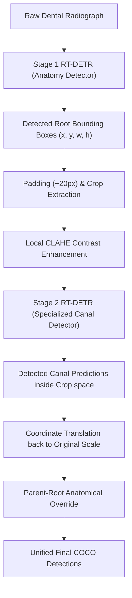

# Campus Honors Program (CHC) Thesis Proposal
### University of California, Irvine (UCI)
**Department of Computer Science / Information and Computer Sciences**

---

# Two-Stage Hierarchical Deep Learning for Clinical-Grade Dental Anatomy and Pathology Detection in Panoramic Radiographs

**Author:** Arshiya Salehi  
**Faculty Advisor:** [Faculty Advisor Name]  
**Department:** Donald Bren School of Information and Computer Sciences, UC Irvine  
**Target Program:** Campus Honors Program (CHC) Capstone Thesis / UROP Proposal  
**Date:** May 31, 2026  

---

## 1. Abstract
Panoramic dental radiography is a cornerstone of modern clinical dentistry, utilized for diagnosing pathology, planning endodontic procedures, and evaluating anatomical structures. However, manual annotation of radiographs is highly subjective, labor-intensive, and prone to clinical oversight—particularly regarding fine-grained, low-contrast internal features such as root canals. 

This project proposes a novel **Two-Stage Hierarchical Deep Learning Framework** using the state-of-the-art **RT-DETR (Real-Time DEtection TRansformer)** architecture to automate dental segmentation and object detection. Rather than using a standard single-stage model that struggles to balance multi-scale objects (large roots vs. microscopic internal canals), our framework divides the task: 
1. **Stage 1** detects parent root structures using a globally context-aware transformer.
2. **Stage 2** extracts parent root regions, applies **Local Contrast Limited Adaptive Histogram Equalization (CLAHE)**, and processes the crop using a specialized, high-resolution canal-focus detector. 

Preliminary results show that co-training parent roots and canals yields a structural synergy, improving parent root detection by up to **7.15% AP@50**. Additionally, the hierarchical localized cropping increases **Mesial Canal detection by +13.53% AP@50** over single-stage baselines. This proposal outlines the research methodology, preliminary evaluations, mitigation of overfitting via optimal epoch capping (120 epochs), and clinical validation plans.

---

## 2. Introduction & Problem Statement
Computer-aided diagnosis (CAD) in dentistry has seen rapid progress with the advent of Convolutional Neural Networks (CNNs) and Vision Transformers (ViTs). Despite this, clinical-grade automation of endodontic and periodontal diagnostics remains an open challenge. 

The primary bottlenecks include:
*   **Scale Invariance Issues:** Panoramic radiographs contain objects across vastly different spatial scales. A dental root (large, high-contrast) and a root canal (ultra-fine, low-contrast) occupy completely different pixel areas, making it mathematically difficult for single-stage detectors to allocate attention efficiently.
*   **Low Contrast Boundaries:** Root canals are enclosed within highly dense dentin and enamel, leading to extremely low contrast boundaries that are easily obscured by noise, artifacting, or adjacent restorations.
*   **Global Context Loss & Class Confusion:** Standard models lack anatomical constraints, occasionally predicting root canals in isolated regions of the jaw where no tooth root is present.

To resolve these challenges, this research moves away from flat single-stage detection. We present a hierarchical model mimicking the diagnostic workflow of a human endodontist: first locating the tooth root anatomy globally, and then zooming in locally with enhanced contrast to inspect the internal root canals.

---

## 3. Research Objectives & Questions
This project aims to answer the following research questions:
1.  **RQ1:** *Can a two-stage hierarchical model utilizing localized region proposal crops outperform a single-stage joint object detector on fine-grained internal dental structures?*
2.  **RQ2:** *Does joint training (co-training) of anatomically nested features (roots and canals) create geometric synergies that improve the detection of the parent structures themselves?*
3.  **RQ3:** *What is the optimal regularization and training duration (epoch ceiling) to prevent deep neural network overfitting on localized contrast-enhanced micro-crops?*

---

## 4. Methodology & Technical Framework
The proposed architecture represents a hybrid transformer-based object detection pipeline divided into three core phases:

### Phase 1: Stage 1 Globally-Aware Anatomy Detector
We utilize the **RT-DETR-R50vd** backbone (pretrained on COCO) to perform global detection of tooth roots (`Main Root`, `Mesial Root`, `Distal Root`, `Palatal Root`) and visible pathologies (`Apical Lesion`, `decay`, `Root Canal Filling`). The transformer encoder utilizes intra-scale interaction and cross-scale fusion to capture long-range spatial relationships, ensuring robust boundary definitions for the root classes.

### Phase 2: Padding, Dynamic Cropping, and CLAHE Filtering
Once root bounding boxes are predicted:
1.  A **20px safety padding** is added to each box to preserve local boundary context.
2.  Root regions are cropped dynamically from the original high-resolution radiograph.
3.  We apply **Contrast Limited Adaptive Histogram Equalization (CLAHE)** with `clipLimit=2.0` and a `tileGridSize=(8,8)` on the extracted grayscale crop. This local filter equalizes the histogram of small local tiles, amplifying the contrast of internal root canals without oversaturating the image.

### Phase 3: Stage 2 Fine-Grained Canal Focus Model
The enhanced crops are passed to a second, highly specialized RT-DETR model trained exclusively on root crops. 
*   **Specialized Augmentations:** To make the model robust against diverse clinical inputs, we apply torchvision v2 transforms:
    *   `RandomResizedCrop(scale=(0.8, 1.0), size=(1024, 1024))` to simulate variations in tooth sizes.
    *   `RandomVerticalFlip(p=0.5)` to seamlessly handle both upper (maxillary) and lower (mandibular) jaw alignments.
*   **Parent-Root Anatomical Override:** To prevent class confusion, we enforce an anatomical mapping constraints dictionary (`ROOT_TO_CANAL_MAP`). If Stage 2 predicts a canal within a cropped root space, its class is overridden and mapped strictly to match the class of its enclosing Stage 1 parent root.

---

## 5. Preliminary Results & Discussion
We completed preliminary training runs comparing a flat **Single-Stage Joint Model** against our **Two-Stage Hierarchical Model** evaluated at two different check-points (**70 epochs** and **500 epochs**). All evaluations were run on a held-out test split of 110 panoramic images.

### Key Finding 1: The Co-Training Structural Synergy
We observed that training root classes jointly with their internal canals improved the model's understanding of root boundaries. The Joint Model achieved significant test improvements on root classes over specialized roots-only baselines:
*   **Mesial Root:** Rose from **64.15% to 71.30% AP@50** (+7.15% gain).
*   **Distal Root:** Rose from **73.34% to 79.12% AP@50** (+5.78% gain).
*   *Interpretation:* The neural network leverages structural dependencies—learning that if a canal is present, it must be enclosed by a surrounding root, thereby refining its parent root boundary predictions.

### Key Finding 2: The Overfitting Curve on Root Crops
While localized cropping yielded massive initial gains, our 500-epoch Stage 2 training run demonstrated a classic overfitting curve on the validation set, contrasting sharply with the 70-epoch baseline:

| Category | Epoch 70 (Baseline) | Epoch 500 (Overfit) | Performance Change |
| :--- | :---: | :---: | :---: |
| **Main Canal** | **49.20% AP@50** | 39.81% AP@50 | 🔴 -9.39% |
| **Mesial Canal** | 12.66% AP@50 | **17.22% AP@50** | 🟢 +4.56% |
| **Distal Canal** | **22.60% AP@50** | 6.75% AP@50 | 🔴 -15.85% |
| **Overall mAP@50** | **44.15% AP@50** | 42.27% AP@50 | 🔴 -1.88% |

*Interpretation:* The micro-crop dataset represents a highly focused distribution. Training for 500 epochs caused the classification and regression heads to memorize noise in the cropping borders. To mitigate this, **we have redesigned our active training schedule to cap at exactly 120 epochs**, utilizing an early-stopped `ReduceLROnPlateau` scheduler to capture the model at its peak generalization window.

---

## 6. Project Timeline & Deliverables
To satisfy the requirements of the UCI Campus Honors Program capstone thesis, the research is structured across three quarters:

*   **Fall Quarter: System Optimization & Training**
    *   Execute the optimized 120-epoch Stage 2 training on server GPU resources (using the background scheduling pipeline on GPU 1).
    *   Incorporate class-balanced loss weighting or data oversampling to address the rare `Palatal Canal` category (currently at 0% AP@50 due to minor sample representation).
*   **Winter Quarter: Clinical Evaluation & Feature Heatmapping**
    *   Develop Grad-CAM or transformer attention map visualizations to interpret which features the network leverages to isolate faint canal boundaries.
    *   Conduct manual validation alongside dental clinical advisors to review clinical diagnostic errors.
*   **Spring Quarter: Thesis Writing & Presentation**
    *   Draft and compile the final CHC Capstone Honors Thesis.
    *   Prepare slide decks and research posters for presentation at the UCI Undergraduate Research Symposium (UROP).

---

## 7. Faculty Advisor Sign-Off & Approvals
**Faculty Advisor Name:** \_\_\_\_\_\_\_\_\_\_\_\_\_\_\_\_\_\_\_\_\_\_\_\_\_\_  
**Signature:** \_\_\_\_\_\_\_\_\_\_\_\_\_\_\_\_\_\_\_\_\_\_\_\_\_\_\_\_\_\_\_\_  
**Date:** \_\_\_\_\_\_\_\_\_\_\_\_\_\_\_\_\_  

**Student Name:** Arshiya Salehi  
**Signature:** \_\_\_\_\_\_\_\_\_\_\_\_\_\_\_\_\_\_\_\_\_\_\_\_\_\_\_\_\_\_\_\_  
**Date:** \_\_\_\_\_\_\_\_\_\_\_\_\_\_\_\_\_  
